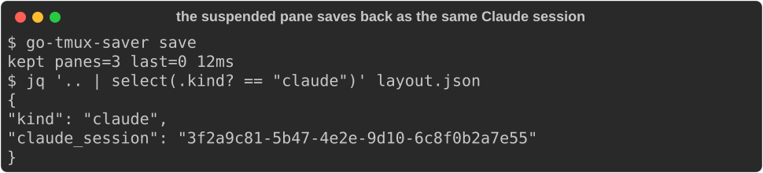
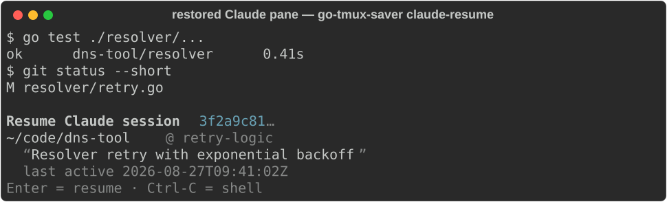
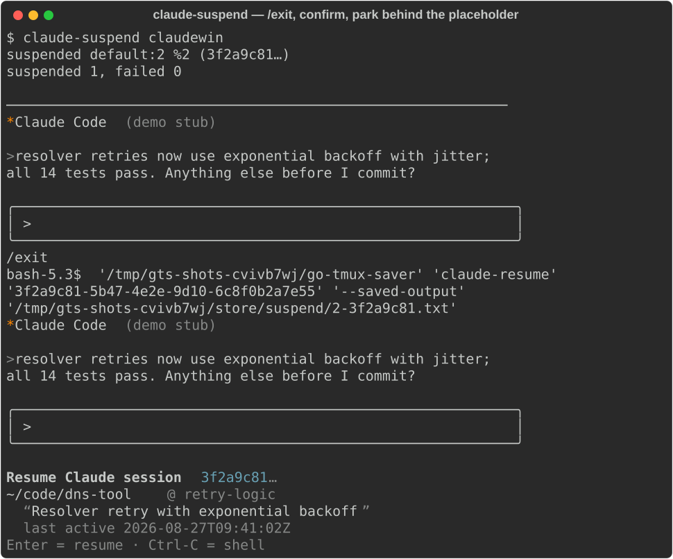

# Claude Code integration

go-tmux-saver treats [Claude Code](https://claude.com/claude-code) sessions
as first-class pane state: a pane running Claude is saved as *which
conversation it held*, restored as a confirm-first placeholder (never a
stampede of relaunched Claudes), and can be parked and picked back up on
demand. This document describes the whole integration; the
[README](../README.md) has the one-paragraph summary.

All screenshots below are generated from **synthetic** sessions — a
fabricated transcript, a stub `claude`, a scratch tmux server — by
[`docs/screenshots/generate.py`](screenshots/generate.py); no real session
data appears anywhere in this repository.

## How a Claude pane is detected at save time

For every pane, the collector walks the pane's `/proc` process subtree and
classifies it (`internal/procs.Resolve`):

1. **Registry match** — a process with comm `claude` whose pid has an entry
   in `~/.claude/sessions/<pid>.json` (written by Claude Code itself) gives
   the session id directly. The entry's `procStart` is validated against
   the live process start time, so a recycled pid or stale file never
   attaches the wrong conversation.
2. **Command-line fallback** — any process in the subtree whose cmdline
   matches `claude-resume <uuid>` or `--resume <uuid>`. This is what makes
   the integration self-describing: a pane still sitting at the
   *placeholder* (below) resolves back to the same session, so
   save → restore → save round-trips losslessly.

The snapshot records `{"kind": "claude", "claude_session": "<uuid>"}` for
the pane — never the conversation content itself.



## The claude-resume placeholder

On restore, each Claude pane gets ` claude-resume <session-id> …` typed
into its shell instead of a blind `claude --resume`: restoring N panes must
not stampede N Claude processes (and their MCP servers) onto a box at once.
The placeholder is **built into the binary** (`go-tmux-saver
claude-resume`, also invoked via the `~/bin/claude-resume` symlink that
`setup install` manages — see below). It shows *which* conversation the
pane held and waits:



- The banner is read from the session's transcript under
  `~/.claude/projects/`: project directory (`~`-shortened), git branch, a
  one-line label (title > rolling summary > first user prompt), worktree
  and last-active time when present.
- Above the banner it reprints the pane's **saved console output** — an
  explicit `--saved-output <file>` (whole file; claude-suspend passes one),
  else the pane's scrollback looked up in the store's last snapshot by
  session id (`--saved-lines` tail, default 100). On a full restore the
  scrollback replay already did this, so the planner passes `--no-saved`.
- **Enter** resumes: the placeholder `exec`s `claude --resume <id>` *from
  the session's original launch directory*. `claude --resume` is
  project-scoped by the current directory's munged name, so the chdir is
  what makes resume work regardless of where the pane was recreated — and
  it is worktree-aware (tested for inner `.worktrees/`, global
  worktree directories, side-by-side worktrees, and munge near-collisions;
  the transcript's own launch cwd always wins). A deleted launch directory
  skips the chdir and still attempts the resume.
- **Ctrl-C** leaves a plain shell in the pane.
- A missing or unrecognised session id falls back to plain `claude` (the
  resume picker); a non-tty stdin announces and resumes without blocking.

## claude-suspend: parking a live session

`claude-suspend` is the reverse door: it turns a *running* Claude pane into
the placeholder, on demand.



For each Claude pane in the target window it:

1. captures the pane's scrollback to `<data-dir>/suspend/` (the future
   placeholder's `--saved-output`),
2. types `/exit` — text first, Enter after a beat, so Claude's
   slash-command palette has settled,
3. **confirms Claude actually exited** by polling `/proc` for the process,
   bounded by `--exit-timeout` (default 30 s). On timeout the pane is
   reported and left running — never force-killed, and the placeholder is
   never typed into a live session,
4. types ` claude-resume <session-id> --saved-output <capture>` into the
   now-shell pane.

Target forms:

```sh
claude-suspend 5            # window 5 of the session group you're in ($TMUX_PANE)
claude-suspend rcfiles      # window by name, same session group
claude-suspend default 5    # explicit session group + window
claude-suspend --all        # every Claude session on the whole server
```

Panes not running Claude are skipped silently; a pane already at the
placeholder resolves as Claude but has no live process, so it is skipped
too (suspend is idempotent).

## The ~/bin/claude-resume symlink

`setup install`/`update` manage `~/bin/claude-resume` as a symlink to the
binary (busybox-style: invoked by that name, the binary *is* the
placeholder), so restores from historical tmux-resurrect saves and muscle
memory keep working with no external script. Replacement is strictly
limited to known predecessors — an absent path, a broken symlink, a
symlink to an old go-tmux-saver binary, or the known rcfiles
claude-resume script (by content checksum). Anything else at that path is
left untouched and reported, and deliberately never counted as validate
drift.

## Configuration

| key | default | meaning |
|---|---|---|
| `claude_resume_path` | `""` | command typed into restored Claude panes. Empty = the built-in `claude-resume` subcommand; a path selects an external helper |
| `allowlist` | includes `claude`, `claude-resume` | process names eligible for argv-restore; Claude detection itself is not allowlist-gated |

## Privacy

Snapshots store the session **id**, the pane's terminal scrollback (as any
pane's is, honouring `contents.enabled`), and nothing from the transcript.
The transcript under `~/.claude/projects/` is only *read*, at
placeholder-display time, on the machine it already lives on.
